# 如何使用

## 1 获取阿里云 API KEY

* [注册阿里云账号](https://www.aliyun.com/)


* 前往[我的API-KEY](https://bailian.console.aliyun.com/?tab=model#/api-key)页面，单击**创建我的API-KEY**。

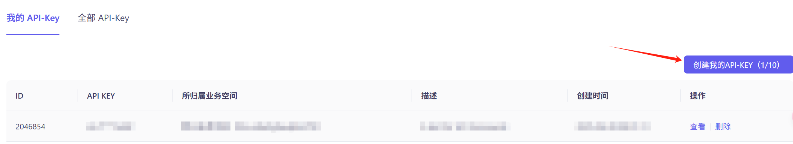

* 选择业务空间（必填）并输入描述（选填）

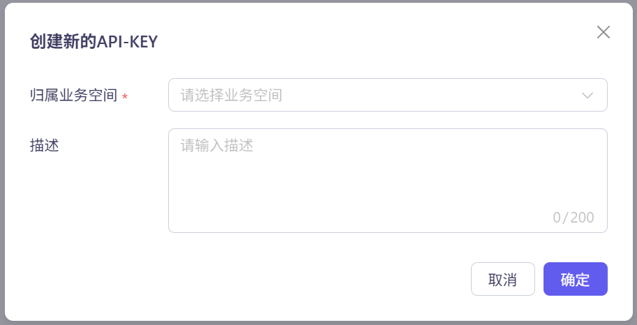

## 2 将 API KEY 配置到环境变量（可选）

* 获得API Key后，建议您将其配置到环境变量中，以便在调用模型或应用时使用。这样可以避免在代码中显式地配置API Key，从而降低API Key泄漏的风险。

* 在**我的API-KEY**页面，单击**查看**

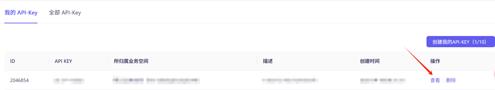

* 再次点击相同位置**复制**，将API Key复制到剪贴板。


* 在Windows系统桌面中按Win+Q键，在搜索框中搜索**编辑系统环境变量**，单击打开**系统属性**界面

* 在**系统属性**窗口，单击**环境变量**，然后在系统变量区域下单击**新建**，**变量名**填入DASHSCOPE_API_KEY，**变量值**填入您的DashScope API Key。

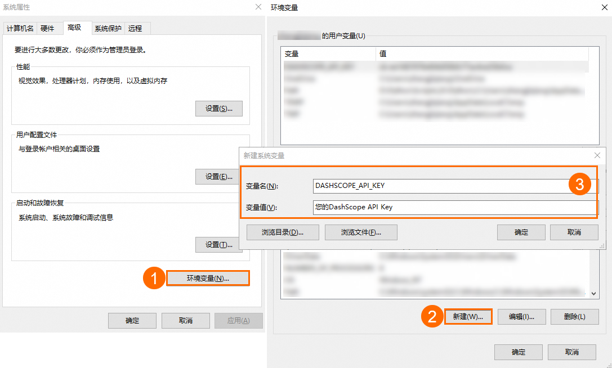

* 依次单击三个窗口的**确定**，关闭系统属性配置页面，完成环境变量配置。

* 打开CMD（命令提示符）窗口或Windows PowerShell窗口，执行如下命令检查环境变量是否生效。

* CMD查询命令:
```shell
echo %DASHSCOPE_API_KEY%
```
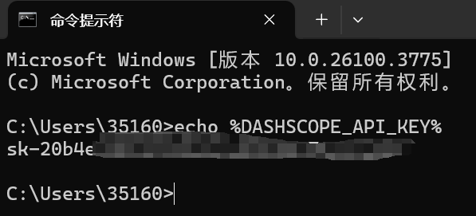

* Windows PowerShell查询命令:
```powershell
echo $env:DASHSCOPE_API_KEY
```

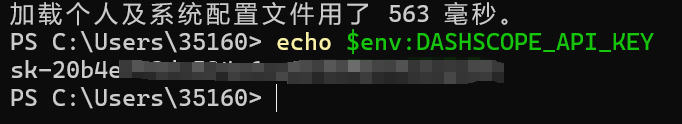

## 获取deepseek API KEY

* [注册deepseek账号](https://platform.deepseek.com/sign_in)

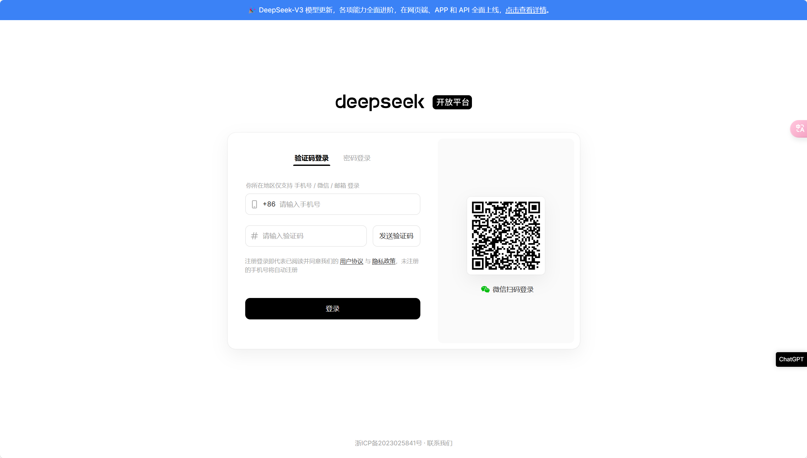

* 前往[API keys](https://platform.deepseek.com/api_keys)页面，单击**创建API key**。

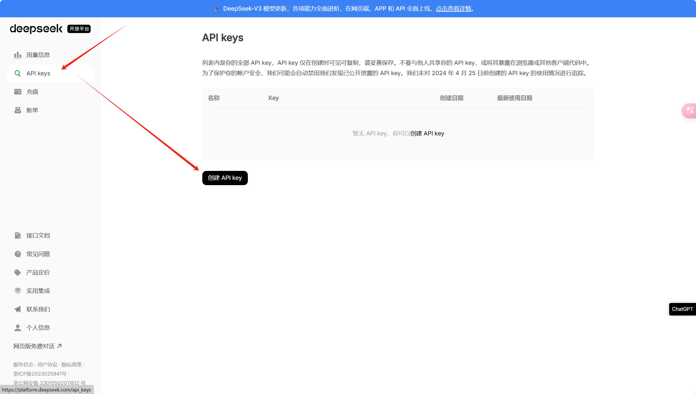

* 输入API key的名称


* 复制API key

* 请将此 API key 保存在安全且易于访问的地方。出于安全原因，你将**无法通过 API keys 管理界面再次查看它**。如果你丟失了这个 key，将需要**重新创建**。

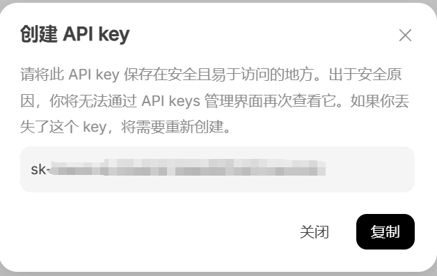

## 4 将 API key 配置到环境变量（可选）

* 方法同上，将deepseek API key配置到环境变量中。

## 5 Environment Configuration

* Download and install Anaconda from the [official website](https://www.anaconda.com).


* Find Anaconda installation directory. Locate the directory where Anaconda is installed on your system. This is typically something like `C:\Users\<Username>\Anaconda3` on Windows.

* Set Anaconda environment variables.
  * Open the start menu and search for "Environment Variables" or navigate to `Control Panel` > `System and Security` > `System` > `Advanced System Settings` > `Environment Variables`.
  * In the environment variables window, under system variables, click on "New" and add the following variables:
    * Variable name: `ANACONDA_HOME`
    * Variable value: path to your Anaconda installation directory (e.g., `C:\Users\<Username>\Anaconda3`)
  * Next, find the "Path" variable in the list of system variables, select it, and click on "Edit".
  * Add the following two entries to the list of paths:
    * `%ANACONDA_HOME%`
    * `%ANACONDA_HOME%\Scripts`
  * Click "OK" to save the changes and close all windows.
  * Restart your computer to apply the changes.

* Verify installation. After setting up the environment variables, open a new terminal or command prompt window and type `conda --version` to verify that Anaconda is now in your system's PATH and accessible from any directory.

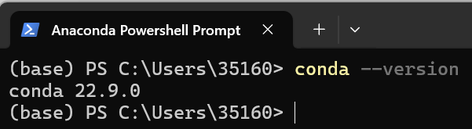

* Update conda packages.

  ```bash
  conda update --all
  ```
  This command updates all packages in the current conda environment to the latest versions available.

* Create a new conda environment for streamlit.

  ```bash
  conda create -n <env_name> python=3.9
  ```
  This command creates a new conda environment named "env_name" with Python version 3.9.

* Activate the streamlit environment.

  ```bash
  conda activate <env_name>
  ```
  This command activates the newly created "env_name" environment, allowing you to work within it.

  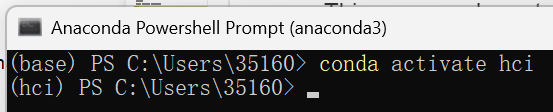

* Install streamlit and streamlit-chat using pip.

  ```bash
  pip install streamlit streamlit-chat
  ```
  This command installs the streamlit package along with its dependencies into the active conda environment using pip.

* Install openai package.

  ```bash
  pip install openai
  ```
Thus far, the environment configuration for the streamlit project has been completed.

## 6 Run Project

* Open the streamlit project directory (`code` folder) in Visual Studio Code.

  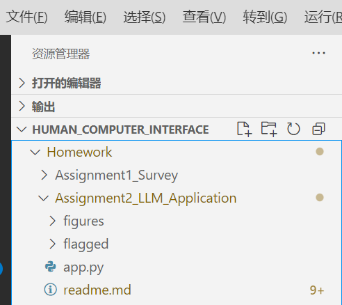

* 打开 app.py文件 ,将API_KEY和deepseek_API_KEY替换为自己的API_KEY。

  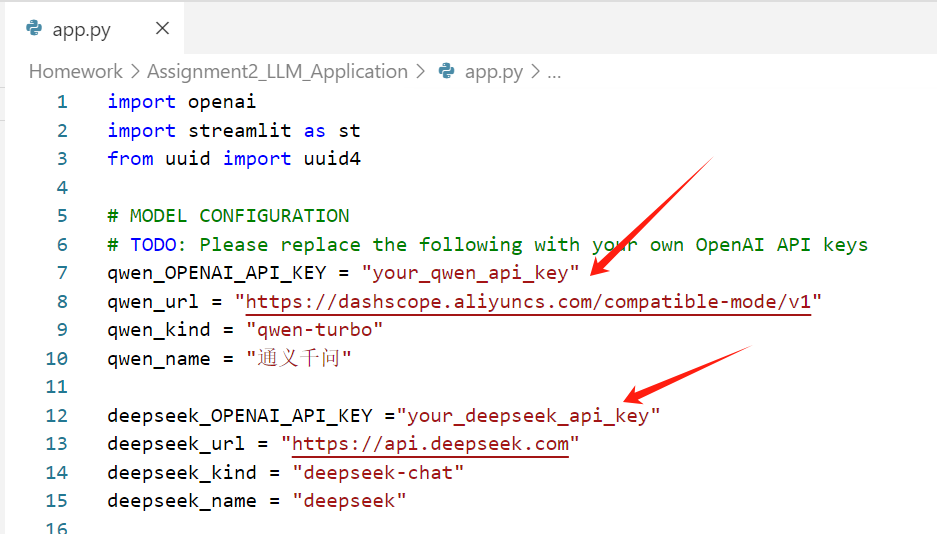

* 打开终端，切换到项目目录

  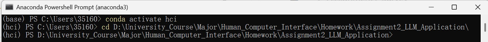

* 运行项目

  ```bash
  streamlit run app.py
  ```

* 现在你可以进行聊天了

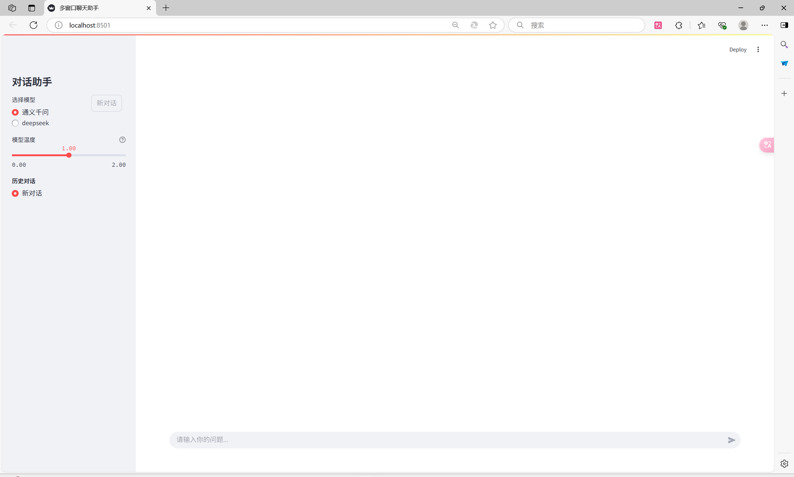