# How to Use

## 1 Get Alibaba Cloud API KEY

* [Register an Alibaba Cloud account](https://www.aliyun.com/)


* Go to [My API-KEY](https://bailian.console.aliyun.com/?tab=model#/api-key) page and click **Create My API-KEY**.

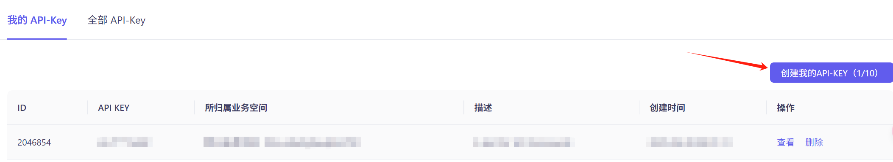

* Select a business space (required) and enter a description (optional)

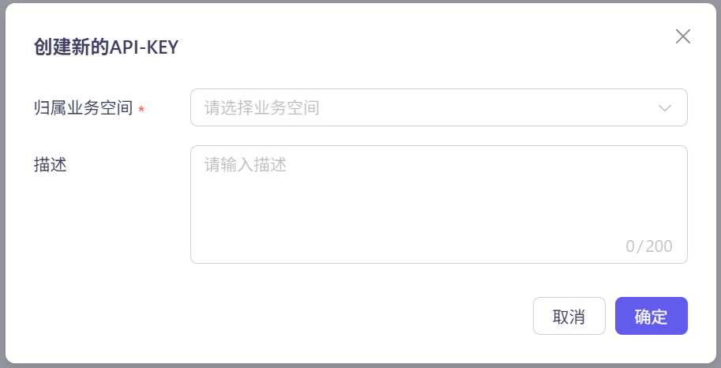

## 2 Configure API KEY to Environment Variables (Optional)

* After obtaining the API Key, it's recommended to configure it into environment variables for use when calling models or applications. This avoids explicitly configuring the API Key in code, reducing the risk of API Key leakage.

* On the **My API-KEY** page, click **View**

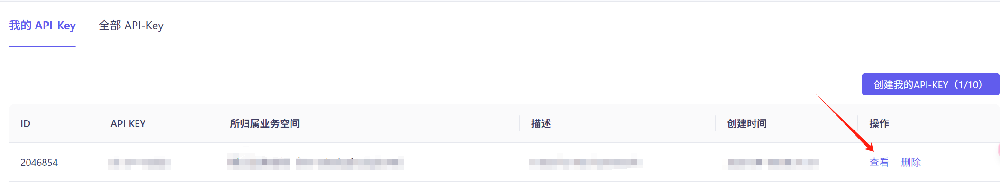

* Click the same position again to **Copy**, copying the API Key to clipboard.

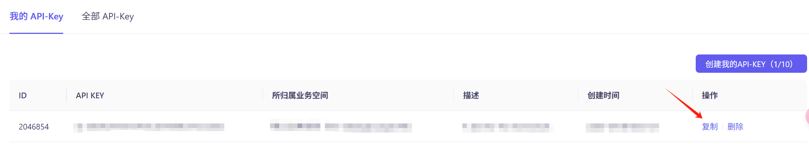

* Press Win+Q on your Windows desktop, search for **Edit system environment variables** in the search box, and open the **System Properties** interface.

* In the **System Properties** window, click **Environment Variables**, then click **New** under System Variables. Enter DASHSCOPE_API_KEY as the **Variable name** and your DashScope API Key as the **Variable value**.

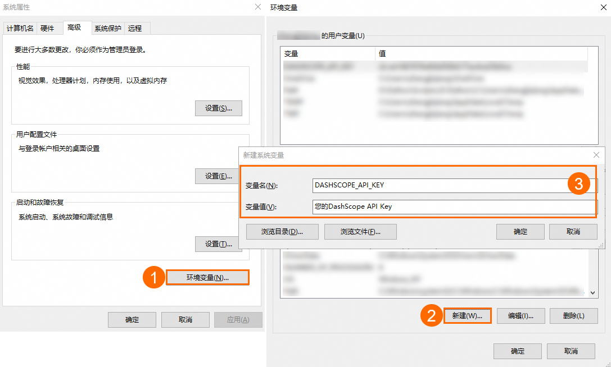

* Click **OK** on all three windows to close the System Properties configuration page and complete the environment variable configuration.

* Open a CMD (Command Prompt) window or Windows PowerShell window and execute the following commands to check if the environment variables are effective.

* CMD query command:
```shell
echo %DASHSCOPE_API_KEY%
```
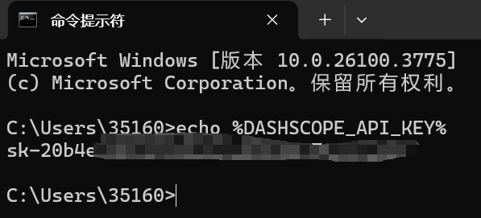

* Windows PowerShell query command:
```powershell
echo $env:DASHSCOPE_API_KEY
```

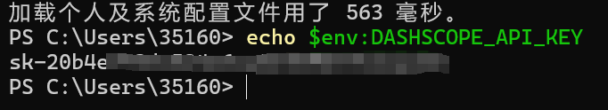

## 3 Get Deepseek API KEY

* [Register a Deepseek account](https://platform.deepseek.com/sign_in)

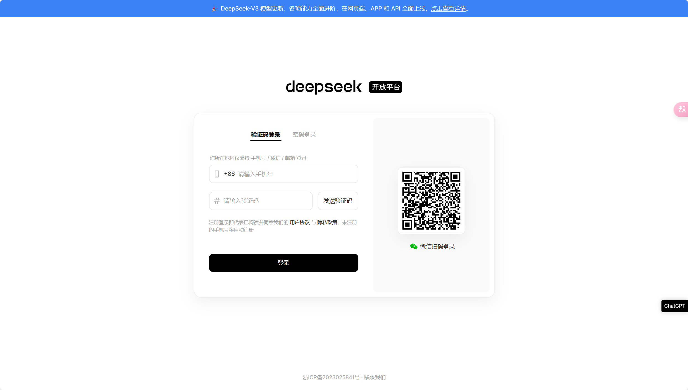

* Go to the [API keys](https://platform.deepseek.com/api_keys) page and click **Create API key**.


* Enter a name for the API key

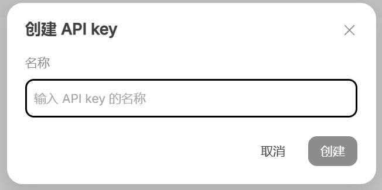

* Copy the API key

* Please save this API key in a secure yet accessible location. For security reasons, you **won't be able to view it again through the API keys management interface**. If you lose this key, you'll need to **create a new one**.

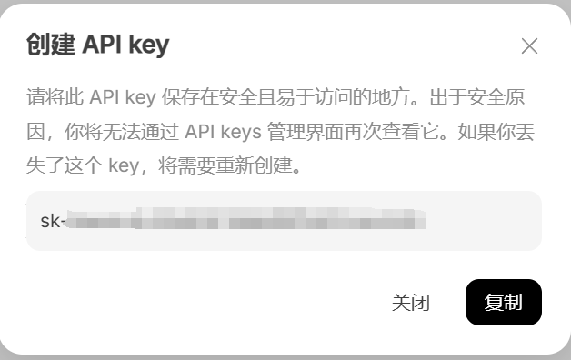

## 4 Configure API key to Environment Variables (Optional)

* The method is the same as above - configure the Deepseek API key into environment variables.
## 5 Environment Configuration

* Download and install Anaconda from the [official website](https://www.anaconda.com).

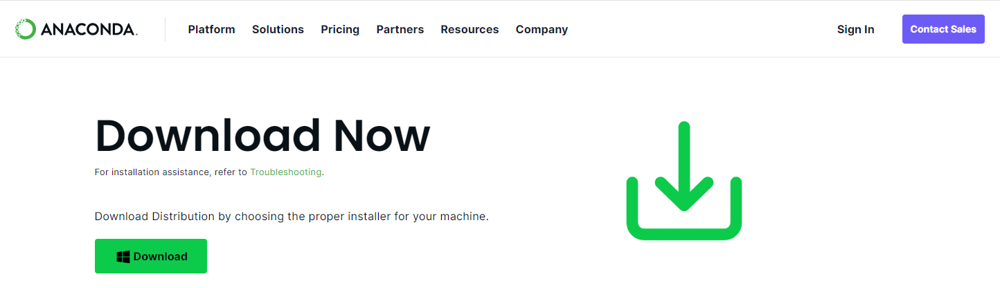

* Find Anaconda installation directory. Locate the directory where Anaconda is installed on your system. This is typically something like `C:\Users\<Username>\Anaconda3` on Windows.

* Set Anaconda environment variables.
  * Open the start menu and search for "Environment Variables" or navigate to `Control Panel` > `System and Security` > `System` > `Advanced System Settings` > `Environment Variables`.
  * In the environment variables window, under system variables, click on "New" and add the following variables:
    * Variable name: `ANACONDA_HOME`
    * Variable value: path to your Anaconda installation directory (e.g., `C:\Users\<Username>\Anaconda3`)
  * Next, find the "Path" variable in the list of system variables, select it, and click on "Edit".
  * Add the following two entries to the list of paths:
    * `%ANACONDA_HOME%`
    * `%ANACONDA_HOME%\Scripts`
  * Click "OK" to save the changes and close all windows.
  * Restart your computer to apply the changes.

* Verify installation. After setting up the environment variables, open a new terminal or command prompt window and type `conda --version` to verify that Anaconda is now in your system's PATH and accessible from any directory.


* Update conda packages.

  ```bash
  conda update --all
  ```
  This command updates all packages in the current conda environment to the latest versions available.

* Create a new conda environment for streamlit.

  ```bash
  conda create -n <env_name> python=3.9
  ```
  This command creates a new conda environment named "env_name" with Python version 3.9.

* Activate the streamlit environment.

  ```bash
  conda activate <env_name>
  ```
  This command activates the newly created "env_name" environment, allowing you to work within it.

  

* Install streamlit using pip.

  ```bash
  pip install streamlit streamlit-chat
  ```
  This command installs the streamlit package along with its dependencies into the active conda environment using pip.

* Install openai package.

  ```bash
  pip install openai
  ```
Thus far, the environment configuration for the streamlit project has been completed.

## 6 Run Project

* Open the streamlit project directory (`code` folder) in Visual Studio Code.

  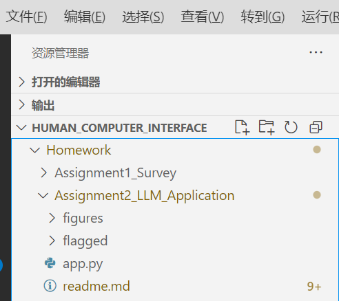

* Open the app.py file and replace both `API_KEY` and `deepseek_API_KEY` with your own API keys.

  

* Open terminal and navigate to the project directory

  

* Run the project

  ```bash
  streamlit run app.py
  ```

* Now you can start chatting!

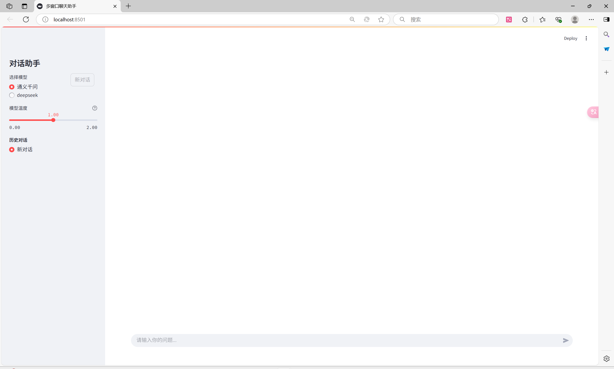