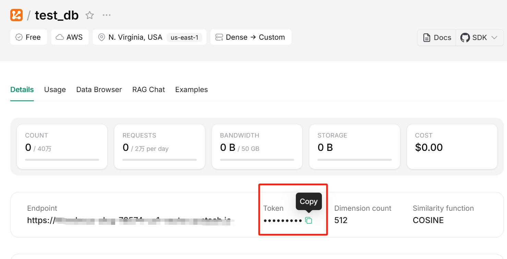

# How to use

## 1. Create a Vector Database

* [**Create a vector database**](https://console.upstash.com/vector?teamid=0)
  


* Click **Create Index** to create a new vector database, enter a database name and **modify Dimension**, then click **Next** to proceed.


* Choose the free version and click **Create** to finish creation.


* Database created successfully.


## 2.Configure Database Info into Environment Variables

* Click **copy** to copy Token/Endpoint.



* Press Win+Q on the Windows desktop, search for **Edit the system environment variables**, and click to open the **System Properties** window.

* In the **System Properties** window, click **Environment Variables**, then under the System variables section, click **New**.
* **Variable name**, enter UPSTASH_VECTOR_URL; for **Variable value**, paste your Endpoint.
* For another **Variable name**, enter UPSTASH_VECTOR_TOKEN; for **Variable value**, paste your Token.


* Click **OK** in all three windows to close the system properties and complete the environment variable configuration.

* Open CMD or Windows PowerShell and run the following commands to check whether the environment variables were applied correctly:

* CMD:

```shell
echo %UPSTASH_VECTOR_URL%
echo %UPSTASH_VECTOR_TOKEN%
```

* PowerShell:

```powershell
echo $env:UPSTASH_VECTOR_TOKEN
echo $env:UPSTASH_VECTOR_URL
```

## 3.Download Dataset

```bash
git clone https://github.com/marcusklasson/GroceryStoreDataset.git
```


* Move the **dataset** directory into this folder


## 4.Environment Setup

* Download and install Anaconda from the [official website](https://www.anaconda.com).


* Find Anaconda installation directory. Locate the directory where Anaconda is installed on your system. This is typically something like `C:\Users\<Username>\Anaconda3` on Windows.

* Set Anaconda environment variables.
  * Open the start menu and search for "Environment Variables" or navigate to `Control Panel` > `System and Security` > `System` > `Advanced System Settings` > `Environment Variables`.
  * In the environment variables window, under system variables, click on "New" and add the following variables:
    * Variable name: `ANACONDA_HOME`
    * Variable value: path to your Anaconda installation directory (e.g., `C:\Users\<Username>\Anaconda3`)
  * Next, find the "Path" variable in the list of system variables, select it, and click on "Edit".
  * Add the following two entries to the list of paths:
    * `%ANACONDA_HOME%`
    * `%ANACONDA_HOME%\Scripts`
  * Click "OK" to save the changes and close all windows.
  * Restart your computer to apply the changes.

* Verify installation. After setting up the environment variables, open a new terminal or command prompt window and type `conda --version` to verify that Anaconda is now in your system's PATH and accessible from any directory.


* Update conda packages.

  ```bash
  conda update --all
  ```
  This command updates all packages in the current conda environment to the latest versions available.

* Create a new conda environment for streamlit.

  ```bash
  conda create -n <env_name> python=3.9
  ```
  This command creates a new conda environment named "env_name" with Python version 3.9.

* Activate the streamlit environment.

  ```bash
  conda activate <env_name>
  ```
  This command activates the newly created "env_name" environment, allowing you to work within it.

  

* Configure vector database environment

```bash
pip install upstash_vector transformers numpy
```

* [ Download pytorch](https://pytorch.org/)

  Choose the appropriate version and enter the installation command in the terminal, or click **Previous versions of PyTorch** to download older versions.
 

* [Set Up CLIP](https://github.com/openai/CLIP)

```bash
pip install ftfy regex tqdm
pip install git+https://github.com/openai/CLIP.git
```

* Install streamlit using pip.

  ```bash
  pip install streamlit
  ```

  This command installs the streamlit package along with its dependencies into the active conda environment using pip.

Thus far, the environment configuration for the streamlit project has been completed.

## 5.Run the Project

* Open the terminal, activate the virtual environment, and switch to the project directory

  

* Load the dataset

  ```bash
  python load_data.py
  ```

  This command loads the dataset into the vector database.

* Run the project

  ```bash
  streamlit run app.py
  ```
